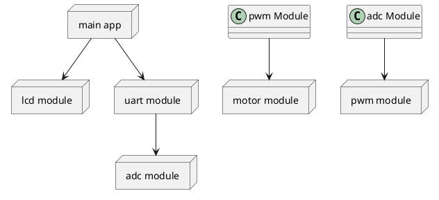
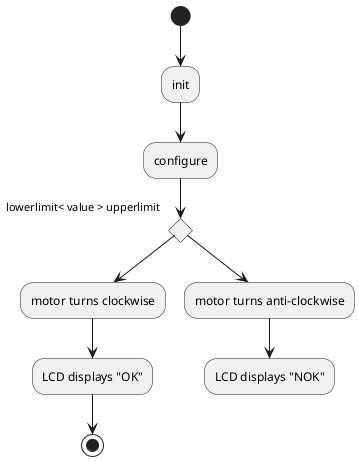
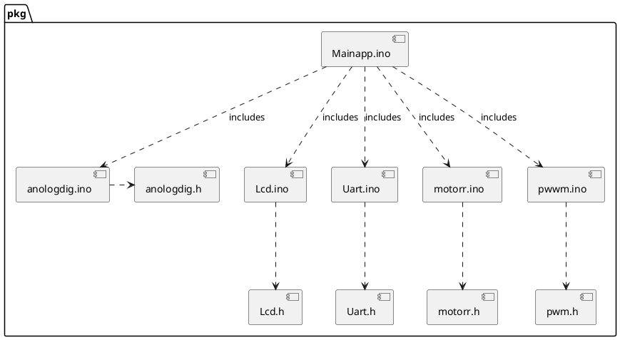

# Detailed Design Document

| **Author**              | `Zeina mohamed elfar & Jumana mohamed hamed`                                       |
|:------------------------|:-----------------------------------------------------|
| **Status**              | `Inspection`                          |
| **Version**             | `1.0`                                                |
| **Date**                | `07/12/2024`                                         |

## Introduction

For our project in this embedded course assignment, we were required to create and design a simple AC panel. This embedded system uses multiple devices and functions to detected the temperature and store the value in memory. The DC motor which in this case will act as a fan, its turn direction is controlled as well as the set speed. Meaning that the motor is designed to spin clockwise when the temperature is within range, and counter-clockwise when out of range. We used a 16x2 LCD interface to display the controlled temperature sensor (LM35) using ADC reading, as well as all the other information. Three push buttons were used to control and reset the upper and lower temperature limits. 

System components:
-	LCD 16x2: Displays readings 
-	LM35: detects temperature of surrounding area 
-	Buttons: used to set upper and lower limits
-	Motor driver: used to set direction and speed for fan

Main features: 
-	Limits are controlled by buttons
-	All needed information displayed on the LCD
-	Values are stores in the memory using EEPROM
-	Fan direction able to be controlled and spins in both directions

### Purpose

This projects purpose is to design and implementation a working AC control panel. We created a circuit with the functionality of using an LM35 temperature sensor to read the surround temperature, this temperature is then displayed onto the LCD screen. The circuit also includes three push buttons, the functionality of these is to control the lower, upper limits of the temperature requirements, and to reset these limits. All these factors will also be displayed onto the LCD for the user to view. Once the lower and upper limits are pressed their values will increase by increments of 5. If the temperature detected from the LM35 is within the range of the lower and upper limit than “OK” will be displayed on the LCD and the motor will turn clockwise causing the fan to also turn. If the temperature is out of range, then the motor will turn counter-clockwise as will the fan, and also “NOK” will be displayed onto the LCD by an Arduino based micro controller. This project is an embedded system design that incudes, user interfaces, real time control systems, and temperature sensor application as well as motor implementation. This system that we created provides climate control by constantly assessing the surrounding temperatures.

### Scope
Classification for design priorities: 

P0 - (required): 
make sure that the all the needed information is shown on the LCD in real time.
Buttons are functioning properly to control temp limits 
Motor direction is interchangeable and controllable

P1- (preferred):
Information is stored in memory using EEPROM

P2 - (optional):
Can add further elements that could improve our system like user friendly interface enhancements

### Industrial Application

The climate control system that we did in this project is used in many industrial applications. It is used in HVAC systems to keep indoor are at an acceptable temperature while also saving energy. In industrial machine cooling, the system keeps the equipment from overheating by adjusting the fan operation. It is used in server rooms and data centers as keeping certain temperature ranges is important to prevent equipment from malfunctioning. The system is also used in agriculture to control the temperature in greenhouses and storage buildings. Lastly, in batteries to make them work better and last longer.
## Architectural Overview

### Assumptions & Constraints

## Functional Description
The functionality is as follows, the code reads the value of the ADC sensor ("sensorreading") and uses the equation of the LM35 to convert it to temperature, compares it with the limits set by push buttons, displays it on the LCD, and rotates the motor. It sets up the push button input pins, ADC, UART,LCD modules and their upper and lower limits stored values in the EEPROM. The code converts the sensor value which is an integer from the ADC into a string, sends it over UART, and displays the string and current limits set on the LCD. The upper and lower limits can be changed by pressing the push buttons. If the sensor reading is within the range set, the code turns the motor clockwise and displays "OK" on the LCD, the pwm will set the motor speed. If not, the motor will rotate counterclockwise and display "NOK" on the LCD, and the pwm will also set the motor speed. This displays real-time monitoring and control of an analog input with adjustable parameters.

## Implementation of the Module
ADC Initialization: Sets up the ADC for the designated channels.

LCD Display Functions: Shows the sensor type, current reading, and threshold limits.

This circuit uses Arduino to portray analog to digital conversion and the displays the digital signals then on the LCD, the circuit uses an LM35 temperature sensor and an LCD screen, buttons and a motor. The motor is used as an indicator to turn in a certain direction depending on the current temperature with the limits set wether in range or not. The Arduino processes the LM35s anolog value input signal and user set limits are shown on the 16x2 LCD display screen almost immediately. The system is constantly reading the LM35s output and checks if the value is within the limit using the ADC and depending on this the motor turns clockwise(within limit) or counterclockwise(outside limits). EEPROM memory is used to store the values of the lower and upper limits so that even when system is not connected to a power source, values will still be stored. Also, the speed of the motor is controlled by using a method called pwm. This system is close to simulating real world control systems in a system where the weather is controlled, such as an AC system. the whole system created would be very useful in an AC system. The temperature sensor would be very useful for to be used as a method of determining if the surrounding temperatures within the limit that the user has set. If the user sets that the AC provide a required temperature of 25 degrees, then the temperature sensor will check the existing temperature compared to the limit that the user has send and adjust accordingly.

## Integration and Configuration
### Static Files

| File name | Contents                             |
|-----------|--------------------------------------|
| Lcd.h | LCD header file containing lcd functions |
| Lcd.ino    | all LCD initialization and functions included|
| Uart.h   | uart header file containing uart functions  |
| Uart.ino   |all uart initialization and functions included |
| analogdig.h  | adc header file containing  adc functions |
| analogdig.ino   | all adc initialization and functions included |
| motorr.h   | motor header file containing  motor functions |
| motorr.ino   | all motor initialization and functions included |
| pwm.h  | pwm header file containing  pwm functions |
| pwwm.ino   | all pwm initialization and functions included |
| mainapp.ino  | includes functions from other files and is where the main code is located the makes the project function |

### Include Structure

### Configuration

| Name | Value range | Description |
|------|-------------|-------------|
| upper temperature limit |  0- infinite but limited by free character spaces on the LCD | This is the  maximum and minimum value range that the upper temperature limit can be set as|
| lower temperature limit |  0- infinite but limited by free character spaces on the LCD    | This is the maximum and minimum value range that the lower temperature limit can be set as|
