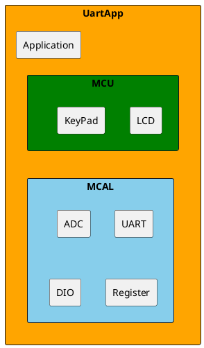
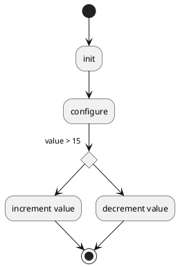
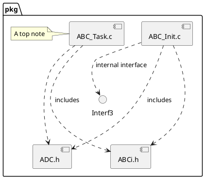

# Detailed Design Document

| **Author**              | `Zeina mohamed elfar & Jumana mohamed hamed`                                       |
|:------------------------|:-----------------------------------------------------|
| **Status**              | `Inspection`                          |
| **Version**             | `1.0`                                                |
| **Date**                | `07/12/2024`                                         |

## Introduction

For our project in this embedded course assignment, we were required to create a simple climate control system that reads temperature and then store the temperature value in the memory. We are required to use a 16x2 LCD interface that displays the controlled temperature sensor (LM35) using ADC reading. Three push buttons were used to control and reset the upper and lower temperature limits, and a motor and battery were added to the circuit. The motor is connected to a fan and designs to spin clockwise when the temperature is within range, and counter-clockwise when out of range.

System components:
-	LCD 16x2: Displays readings 
-	LM35: detects temperature of surrounding area 
-	Buttons: used to set upper and lower limits
-	Motor: used to control fan movement 

### Purpose

For this project design and implementation we created a circuit with the functionality of using an LM35 temperature sensor to read the surround temperature, this temperature is then displayed onto the LCD screen. The circuit also includes three push buttons, the functionality of these is to control the lower, upper limits of the temperature requirements, and to reset these limits. All these factors will also be displayed onto the LCD for the user to view. Once the lower and upper limits are pressed their values will increase by increments of 5. If the temperature detected from the LM35 is within the range of the lower and upper limit than “OK” will be displayed on the LCD and the motor will turn clockwise causing the fan to also turn. If the temperature is out of range, then the motor will turn counter-clockwise as will the fan, and also “NOK” will be displayed onto the LCD by an Arduino based micro controller. This project is an embedded system design that incudes, user interfaces, real time control systems, and temperature sensor application as well as motor implementation.

### Scope

## Architectural Overview

This section describes where this module resides in the context of the software architecture

### Assumptions & Constraints
Indicate constraints of the low level design and any assumptions appropriate for the design.

## Functional Description
The following chapter describes the software functionality.  The following is a list of suggested sections to be considered for inclusion.

## Implementation of the Module
This chapter discusses the detailed design of the module.

## Integration and Configuration
### Static Files
Typically a module consists of C and H files but other file types may exist. List all files that form this module

| File name | Contents                             |
|-----------|--------------------------------------|
| abc_xxx.c | Source code file, add detail         |
| abc.h     | Export Interface file                |
| abci.h    | Import and Module Configuration file |

### Include Structure

If there is a complex file structure e.g. more than one c-file or more than two h-files use a diagram to explain the relationship between the source and dependent include files.

### Configuration
Any required hardware/software or system configuration that can be adjusted a header file shall be detailed in this section. This can be placed in the table below.
| Name | Value range | Description |
|------|-------------|-------------|
|      |             |             |
