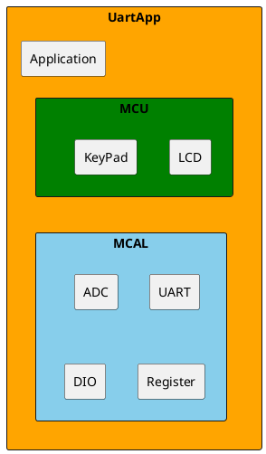
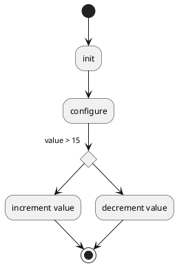
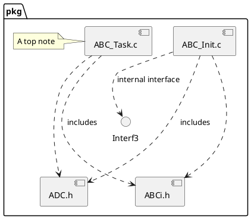

# Detailed Design Document

| **Author**              | `Zeina mohamed elfar & Jumana mohamed hamed`                                       |
|:------------------------|:-----------------------------------------------------|
| **Status**              | `Inspection`                          |
| **Version**             | `1.0`                                                |
| **Date**                | `07/12/2024`                                         |

## Introduction

For our project in this embedded course assignment, we were required to create and design a simple AC panel. This embedded system uses multiple devices and functions to detected the temperature and store the value in memory. The DC motor which in this case will act as a fan, its turn direction is controlled as well as the set speed. Meaning that the motor is designed to spin clockwise when the temperature is within range, and counter-clockwise when out of range. We used a 16x2 LCD interface to display the controlled temperature sensor (LM35) using ADC reading, as well as all the other information. Three push buttons were used to control and reset the upper and lower temperature limits. 

System components:
-	LCD 16x2: Displays readings 
-	LM35: detects temperature of surrounding area 
-	Buttons: used to set upper and lower limits
-	Motor driver: used to set direction and speed for fan

Main features: 
-	Limits are controlled by buttons
-	All needed information displayed on the LCD
-	Values are stores in the memory using EEPROM
-	Fan direction able to be controlled and spins in both directions

### Purpose

This projects purpose is to design and implementation a working AC control panel. We created a circuit with the functionality of using an LM35 temperature sensor to read the surround temperature, this temperature is then displayed onto the LCD screen. The circuit also includes three push buttons, the functionality of these is to control the lower, upper limits of the temperature requirements, and to reset these limits. All these factors will also be displayed onto the LCD for the user to view. Once the lower and upper limits are pressed their values will increase by increments of 5. If the temperature detected from the LM35 is within the range of the lower and upper limit than “OK” will be displayed on the LCD and the motor will turn clockwise causing the fan to also turn. If the temperature is out of range, then the motor will turn counter-clockwise as will the fan, and also “NOK” will be displayed onto the LCD by an Arduino based micro controller. This project is an embedded system design that incudes, user interfaces, real time control systems, and temperature sensor application as well as motor implementation. This system that we created provides climate control by constantly assessing the surrounding temperatures.

### Scope
Classification for design priorities: 

P0 - (required): 
make sure that the all the needed information is shown on the LCD in real time.
Buttons are functioning properly to control temp limits 
Motor direction is interchangeable and controllable

P1- (preferred):
Information is stored in memory using EEPROM

P2 - (optional):
Can add further elements that could improve our system like user friendly interface enhancements

### Industrial Application

The climate control system that we did in this project is used in many industrial applications. It is used in HVAC systems to keep indoor are at an acceptable temperature while also saving energy. In industrial machine cooling, the system keeps the equipment from overheating by adjusting the fan operation. It is used in server rooms and data centers as keeping certain temperature ranges is important to prevent equipment from malfunctioning. The system is also used in agriculture to control the temperature in greenhouses and storage buildings. Lastly, in batteries to make them work better and last longer.
## Architectural Overview

This section describes where this module resides in the context of the software architecture

### Assumptions & Constraints
Indicate constraints of the low level design and any assumptions appropriate for the design.

## Functional Description
The following chapter describes the software functionality.  The following is a list of suggested sections to be considered for inclusion.

## Implementation of the Module
This chapter discusses the detailed design of the module.

## Integration and Configuration
### Static Files
Typically a module consists of C and H files but other file types may exist. List all files that form this module

| File name | Contents                             |
|-----------|--------------------------------------|
| abc_xxx.c | Source code file, add detail         |
| abc.h     | Export Interface file                |
| abci.h    | Import and Module Configuration file |

### Include Structure

If there is a complex file structure e.g. more than one c-file or more than two h-files use a diagram to explain the relationship between the source and dependent include files.

### Configuration
Any required hardware/software or system configuration that can be adjusted a header file shall be detailed in this section. This can be placed in the table below.
| Name | Value range | Description |
|------|-------------|-------------|
|      |             |             |
